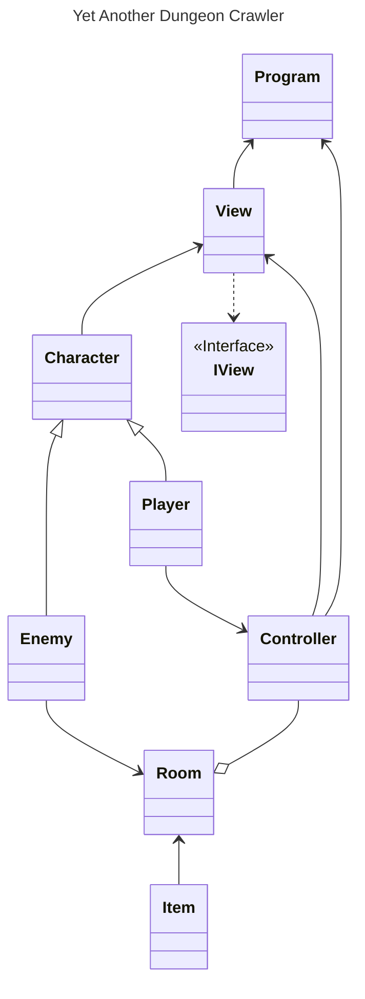
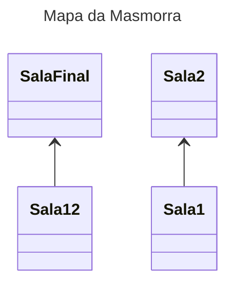

# Yet Another Dungeon Crawler

### Autoria

**Hugo da Silva 22304809**
1. Organização Inicial do Projeto
2. Estrutura do Projeto (MVC)
3. README.md + UML das classes
4. Mapa da Masmorra

**Tomás Cardoso 22303462**
1. Item Usável
2. Inimigo ataca de volta
3. Sistema de Respawn
4. Final do Jogo (Por morrer ou chegar ao final)
5. 

**Leonardo Henrique 22304949**
1. Bug Fixing 
2. Base do Ficheiro Character.cs
3. Impedir que o jogo dê Crash ao atacar uma sala Vazia

###### Git Utilizado: https://github.com/HugoSilva2/YetAnotherDungeonCrawler

### Arquitetura da Solução

A solução está estruturada em MVC:
* **Program.cs**: Ficheiro Principal

* **MODEL**:
  * **Character.cs**: Ficheiro com os atributos para os personagens
  * **Enemy.cs**: Ficheiro com a informação do Inimigo
  * **Player.cs**: Ficheiro com a informação e tudo que o Player pode Fazer
  * **Room.cs**: Ficheiro com os atributos das salas
  * **Items.cs**: Ficheiro com a infromação dos itens

* **VIEW**:
  * **View.cs**: Ficheiro com todos os Writelines
  * **IView.cs**: Interface da View

* **CONTROLLER**:
  * **Controller.cs**: Ficheiro com Game Loop

_________________________________________________

**UML de Classes:**

_________________________________________________

